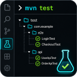

<p align="center">
  
</p>

# Maven Test Explorer Bridge

> Run Java tests with Maven and inspect Surefire/Failsafe results in a dedicated VS Code Testing-sidebar view — no Microsoft Java Test Runner required.

[](CHANGELOG.md)
[](https://code.visualstudio.com/)
[](LICENSE)
[](https://marketplace.visualstudio.com/items?itemName=covenant-17.maven-test-explorer-bridge)

Maven Test Explorer Bridge discovers JUnit 5 tests from Java sources, starts Maven runs on demand, watches XML reports produced by Maven Surefire and Failsafe, and renders the combined state in its own **Maven Test Explorer** view. Tests started from a terminal, CI task, or coding agent are picked up through the same report-watching flow.

## Features

- **Dedicated Tree and List views** — browse deterministic project, package, class, method, dynamic-invocation, and lifecycle nodes.
- **Reactor-aware multi-module discovery** — locate Maven modules across multi-root workspaces and execute each top-level reactor only once.
- **JUnit 5 source discovery** — recognize `@Test`, `@ParameterizedTest`, `@RepeatedTest`, `@TestFactory`, nested classes, and inherited test-interface methods.
- **Surefire and Failsafe result mapping** — show passed, failed, errored, skipped, and total counts while retaining source navigation and error details.
- **Responsive large suites** — virtualized rows keep large projects responsive while names and metadata yield space to result statistics.
- **Run from the UI** — run all reactors or a non-recursive project, package, class, method, or grouped multi-selection through Maven.
- **Interactive Maven profiles** — select one or more color-coded profiles beside the search field; the extension also resolves the profiles Maven actually activates.
- **Live runtime feedback** — show running classes, partial XML results, elapsed time, view-title progress, status-bar progress, and aggregate counters while Maven is active.
- **Stop Current Run** — terminate the active Maven process tree and retain partial results as a cancelled history entry.
- **Run History** — store and restore completed, failed, or cancelled result sets per workspace, or switch back to the pinned current run while Maven is active.
- **Re-run Failed** — rerun failed or errored classes in the exact Maven module that produced each report.
- **Flexible filtering** — combine text, aggregate result status, JUnit tag, and string-annotation terms with AND/OR expressions.
- **Maven/JUnit selector search** — paste `Class#method` or `fully.qualified.Class#method` to find a specific test method.
- **Flexible sorting** — sort by source location, name, status, or duration in ascending or descending order.
- **Configurable rows** — independently choose visible Tree/List row parts and metadata while retaining the required expander.
- **Context actions and multi-selection** — run selected nodes or copy Maven commands, packages, FQCNs, paths, and method names.
- **Source navigation** — open discovered methods, lifecycle errors, inherited declarations, or concrete implementation classes.
- **Inline Testing API bridge** — keep editor gutter runs, live failure messages, error peek, and reveal actions connected to the custom explorer.
- **Agent Bridge** — let coding agents inspect, start, follow, and stop the same managed Maven run through JSON CLI or MCP tools.

## Requirements

- VS Code `^1.84.0`
- A workspace containing at least one `pom.xml`
- JUnit 5 tests in Java source files matched by `mavenTestExplorer.testSourceGlobs`
- Maven Wrapper (`mvnw` / `mvnw.cmd`) in the module or its parent, or Maven available through `mavenTestExplorer.mavenExecutable`
- Maven Surefire or Failsafe XML reports for result synchronization
- Node.js 20 or newer when using the optional Agent Bridge CLI or MCP server

## Getting Started

1. Install the extension from the [Visual Studio Marketplace](https://marketplace.visualstudio.com/items?itemName=covenant-17.maven-test-explorer-bridge).
2. Open a folder or multi-root workspace containing one or more `pom.xml` files.
3. Open the Testing sidebar and expand **Maven Test Explorer**.
4. Use **Run All** or a row action to start Maven, or run the project's wrapper/Maven command in a terminal.
5. The explorer updates when matching Surefire/Failsafe `TEST-*.xml` files are written.

By default the extension prefers the Maven Wrapper and falls back to `mvn`. Change the executable, goals, profiles, arguments, source globs, or report globs when the project uses a different layout.

Use the profile button to the right of the search field to activate any number of discovered Maven profiles for subsequent runs. The tooltip distinguishes the persistent selection from profiles Maven currently activates through the POM, `settings.xml`, properties, JDK, and other activation rules; effective state is resolved with `help:active-profiles`. Saved POM changes refresh profile metadata and effective state after a short debounce without rescanning Java tests. Profile colors are assigned deterministically from VS Code theme colors. Hover a profile to read `<mavenTestExplorer.profileDescription>` from that profile's `<properties>` in `pom.xml`; profiles without one show the supported markup. The source button pinned to a declared profile opens its `<profile>` line in the owning POM. A direct custom `<description>` is also read for compatibility, although Maven itself rejects that non-standard profile element.

## Using the Explorer

### Toolbar

| Button | Action |
|---|---|
| ▶ | Run each top-level Maven reactor once and collect every child-module report |
| ■ | Stop the active run; visible only while Maven is running |
| ↺ | Rescan modules and Java test sources |
| 🕐 | Open Run History and restore a previous result set |
| ⇔ | Expand or collapse the visible hierarchy |
| 🗑 | Clear results, or clear results and history |
| ≡ | Sort by location, name, status, or duration |
| ☷ | Switch between Tree and flat List views |

### Selection and navigation

- Click a row to select it; use `Ctrl+Click` / `Cmd+Click` to toggle items and `Shift+Click` to select a range.
- A parent and its selected descendants are deduplicated before Maven targets are generated.
- Double-click a source-backed row or press `Enter` to open its Java declaration.
- Press `Space` to run the focused row. Use the context-menu key or `Shift+F10` for row actions.
- Right-click a multi-selection to run it as a group or open **Copy...** actions. **Copy Full Path** on a method includes both its selector and source anchor, for example `com.example.AppTest#wrongGreet() — C:\workspace\src\test\java\com\example\AppTest.java:67`.

### Filter syntax

The filter retains matching ancestors so that results remain navigable. Type `@` to open contextual suggestions with match counts.

| Goal | Example |
|---|---|
| Text, class, package, or method search | `AudiencesBotsAddBotTest` |
| Maven/JUnit class-method selector | `AudiencesBotsAddBotTest#shouldAddBotByUsername` |
| Project-scoped JUnit tag | `@javatest.smoke` |
| Status | `@passed`, `@failed`, `@error`, `@skipped`, or `@executed` |
| Annotation name | `@javatest.annotation.knownissue` |
| Annotation value contains text | `@javatest.annotation.knownissue=TEST-4` |
| Annotation value equals text | `@javatest.annotation.knownissue="TEST-401"` |
| All terms | `@javatest.smoke AND @failed` or `@javatest.smoke, @failed` |
| Alternative terms | `@failed OR @skipped` |
| Grouped expression | `@executed AND (@failed OR @skipped)` |

`AND` and `&&` are equivalent; comma is also AND. `OR` and `||` are equivalent. Operators are case-insensitive, AND binds more tightly than OR, and parentheses can make precedence explicit. Project namespaces are derived from the Maven module directory name and are shown by suggestions.

## Commands

The following user-facing commands are registered. Toolbar-only sort, view, expand/collapse, and inline-reveal commands are intentionally omitted from the Command Palette.

| Command title | Description |
|---|---|
| `Maven: Refresh Tests` | Rescan Maven modules and Java test sources |
| `Maven: Run All Tests` | Run the configured goals once per top-level reactor |
| `Maven: Stop Current Run` | Cancel the active Maven process tree |
| `Maven: Re-run Failed Tests` | Rerun failed or errored classes in their originating modules |
| `Maven: Clean Test Reports` | Delete matching `TEST-*.xml` report files |
| `Clear Test Results` | Reset current results while preserving history |
| `Clear Results & History` | Reset current results and delete stored run history |
| `Maven: Show Run History` | Browse and restore stored result sets |
| `Configure Tree Visible Parts...` | Choose parts and metadata displayed in Tree rows |
| `Configure List Visible Parts...` | Choose parts and metadata displayed in List rows |

VS Code may prefix these titles with the **Maven Test Explorer** command category.

## Configuration

### Test Discovery

| Setting | Default | Purpose |
|---|---|---|
| `mavenTestExplorer.mavenExecutable` | `"mvn"` | Executable used when a wrapper is disabled or not found |
| `mavenTestExplorer.preferMavenWrapper` | `true` | Prefer `mvnw` / `mvnw.cmd` from the module or its immediate parent |
| `mavenTestExplorer.testSourceGlobs` | `["**/src/test/java/**/*.java"]` | Java source patterns used for discovery and file watching |
| `mavenTestExplorer.autoRefreshOnSave` | `true` | Rediscover tests when a matching source file changes |
| `mavenTestExplorer.autoRefreshDebounceMs` | `500` | Delay source rediscovery by 100–5000 ms after changes |

### Test Execution

| Setting | Default | Purpose |
|---|---|---|
| `mavenTestExplorer.defaultCommand` | `"clean test"` | Goals used by Run All |
| `mavenTestExplorer.agentDefaultCommand` | `"test"` | Safe default goals used by Agent Bridge all-scope runs |
| `mavenTestExplorer.defaultProfiles` | `[]` | Profiles added to every Maven invocation; the profile picker writes its selection here |
| `mavenTestExplorer.additionalArgs` | `""` | Extra arguments added to every Maven invocation |
| `mavenTestExplorer.clearReportsBeforeRun` | `true` | Remove old matching XML reports before an extension-started run |
| `mavenTestExplorer.agentClearReportsBeforeRun` | `false` | Preserve existing XML reports for Agent Bridge runs unless explicitly overridden |
| `mavenTestExplorer.testClassCommandTemplate` | `"{maven} {profiles} {args} -Dtest={className} test"` | Template for class, method, grouped, and failed-test runs |

The class command template supports `{maven}`, `{profiles}`, `{args}`, `{className}`, and `{methodName}` placeholders. The default grouped selector is passed through `{className}`.

Run All preserves normal Maven reactor behavior. Scoped UI runs and copied scoped commands add `-N` unless the command already contains `-N` or `--non-recursive`, preventing an aggregator POM from rerunning its children.

### Results and Display

| Setting | Default | Purpose |
|---|---|---|
| `mavenTestExplorer.showOutputChannel` | `true` | Reveal Maven output when an extension-started run begins |
| `mavenTestExplorer.reportGlobs` | Surefire and Failsafe `TEST-*.xml` globs | Locate reports for loading, watching, and cleanup |
| `mavenTestExplorer.watchReports` | `true` | Apply report changes produced outside the extension |
| `mavenTestExplorer.rowLayout` | All supported parts and metadata | Configure Tree/List status, kind, name, metadata, duration, and statistics |

Use the Row Layout setting links or the two **Configure ... Visible Parts** commands for compact multi-select pickers. The expander is always retained. Metadata can independently show the original name hidden by `@DisplayName`, tags, inherited sources, List-view class context, and virtual-test hints.

When horizontal space is limited, metadata is truncated first, followed by duration and the test name. Expanders, status/kind icons, and aggregate statistics are preserved longest.

### Run History

| Setting | Default | Purpose |
|---|---|---|
| `mavenTestExplorer.runHistoryEnabled` | `true` | Save newly completed or cancelled runs in workspace storage |
| `mavenTestExplorer.maxHistoryEntries` | `20` | Keep the newest 1–100 history entries |

While Maven is running, **Maven: Show Run History** pins **Current run** above stored snapshots. Selecting it restores the latest partial results and loader state. If the run finishes while an older snapshot is visible, the explorer automatically returns to the completed result.

### Agent Bridge

The Agent Bridge exposes the extension's existing Maven runner to local coding agents. The extension must be active in the target workspace; CLI and MCP never start a separate Maven process. Click **Copy AI Agent Setup** (the terminal icon in the Maven Test Explorer title toolbar) to copy a self-contained setup packet for Codex or Claude Code. The packet explains its purpose and includes workspace-scoped MCP configuration, an `AGENTS.md` / `CLAUDE.md` policy block, verification steps, and CLI fallback commands.

CLI examples (replace `mteb-cli.cjs` with the copied installed path):

```powershell
node mteb-cli.cjs --help
node mteb-cli.cjs status --workspace . --json
node mteb-cli.cjs config --workspace . --json
node mteb-cli.cjs profiles --workspace . --json
node mteb-cli.cjs profiles --workspace . --profile local --profile parallel --json
node mteb-cli.cjs profiles --workspace . --clear --json
node mteb-cli.cjs run --workspace . --goal test --profile parallel --property HEADLESS=true --json
node mteb-cli.cjs run --workspace . --test LoginTest --test ProfileMenuNavigationTest --property HEADLESS=true --json
node mteb-cli.cjs wait --workspace . --run <run-id> --timeout 300 --json
node mteb-cli.cjs output --workspace . --run <run-id> --tail 200 --json
node mteb-cli.cjs stop --workspace . --run <run-id> --json
```

Running the CLI without arguments, with `--help`, or as `<command> --help` prints the complete command and option reference. Agent Bridge defaults are intentionally separate from interactive UI defaults: agents use `test` and preserve existing reports unless the request or workspace configuration explicitly opts into cleanup. Preserved reports remain on disk, while only XML files created or changed during the managed run contribute to that run's result.

The bundled stdio MCP server provides these tools:

- `maven_tests_get_status`
- `maven_tests_get_configuration`
- `maven_tests_set_profiles`
- `maven_tests_start`
- `maven_tests_wait`
- `maven_tests_get_output`
- `maven_tests_stop`

Agents should always check status before starting tests. Only one managed run is accepted at a time. `maven_tests_wait` blocks until the requested run completes or its timeout expires without cancelling Maven. Final snapshots expose `failures` entries as `{test, message}` for failed and errored cases and a ready-to-display `surefireSummary` line. Runs started directly with `mvn` remain unmanaged: their Surefire/Failsafe XML results are still imported, but the extension cannot report their PID, command, exit code, output, or cancellation state.

The **Copy AI Agent Setup** toolbar action includes an upgrade section for existing installations. It tells agents to update their existing `AGENTS.md` or `CLAUDE.md` policy block with waiting, structured failure handling, and safe-default behavior without duplicating the block.

## How It Works

```text
pom.xml + configured Java source globs
                 │
                 ▼
 Maven module detector + Java source scanner
                 │
                 ▼
        Custom test model ───────────────► Maven Test Explorer webview
                 ▲                                  │
                 │                                  └─ run/copy/open/filter actions
                 │
 Surefire/Failsafe TEST-*.xml ◄────────── Maven or Maven Wrapper
                 │
                 ▼
        XML parser + result cache ───────► inline Testing API results/error peek
                 │
                 └───────────────────────► workspace-scoped Run History
```

The custom webview is the primary explorer UI. The native VS Code Testing API is retained as a minimal bridge for editor gutter actions, scoped inline runs, result messages, error peek, and reveal-in-custom-explorer behavior.

## Troubleshooting

- **No Maven modules:** confirm that the open workspace contains `pom.xml` and that it is not under `target/`.
- **No discovered tests:** check `mavenTestExplorer.testSourceGlobs`; discovery reads Java sources and does not use compiled test metadata.
- **Maven does not start:** check the Maven Test Explorer output channel, wrapper location, and `mavenTestExplorer.mavenExecutable`.
- **More diagnostic output is needed:** run **Developer: Set Log Level...**, select **Maven Test Explorer**, and choose **Debug** to include report-watcher, cache, discovery, and XML parsing details.
- **No or stale results:** verify `mavenTestExplorer.reportGlobs`, `watchReports`, and the actual Surefire/Failsafe output paths. Use **Maven: Clean Test Reports** when necessary.
- **A custom selector fails:** adapt `mavenTestExplorer.testClassCommandTemplate` to the test plugin's selector syntax.
- **A row is missing after filtering:** clear the filter with `Escape` or the filter clear button, then refresh discovery.

## Development

```powershell
npm ci
npm test
npm run compile
npm run package
npx @vscode/vsce ls
```

- `npm test` covers Maven reactor planning, stable module identity, nested-module ownership, result ownership, scoped arguments, watcher refreshes, and run outcomes.
- `npm run compile` performs strict TypeScript checking, runs the tests, validates generated webview JavaScript/layout invariants, and creates a development bundle.
- `npm run package` repeats the checks and creates the production bundle in `dist/extension.js`.
- `npx @vscode/vsce ls` shows the files that will be included in the extension package.

Automated checks do not replace an Extension Development Host smoke test for visual or interaction changes.

## Project Structure

```text
src/
├── extension.ts             # Activation, commands, discovery/watchers, execution, state
├── customTestModel.ts       # Custom hierarchy, filtering, sorting, runtime aggregation
├── customTestWebview.ts     # Dedicated explorer HTML, styling, rendering, interactions
├── inlineTestBridge.ts      # Minimal native Testing API/editor bridge
├── javaTestScanner.ts       # Java source discovery and inherited test contracts
├── mavenProjectDetector.ts  # pom.xml discovery and module metadata
├── mavenModule.ts           # Stable module IDs, POM descriptors, reactor grouping
├── mavenRunner.ts           # Maven argument generation, process output, cancellation
├── runPlanning.ts           # Scoped arguments and run outcome rules
├── surefireParser.ts        # Surefire/Failsafe TEST-*.xml parsing
├── resultPublisher.ts       # Result mapping, messages, stack frames, inline output
├── filterExpression.ts      # AND/OR filter tokenizer and parser
├── rowVisibility.ts         # Configurable Tree/List row parts and metadata
├── runHistory.ts            # Workspace-scoped result history
├── settings.ts              # Typed configuration reader
└── constants.ts             # Command, setting, and glob identifiers
```

## License

[MIT](LICENSE) © [covenant-17](https://github.com/covenant-17)
